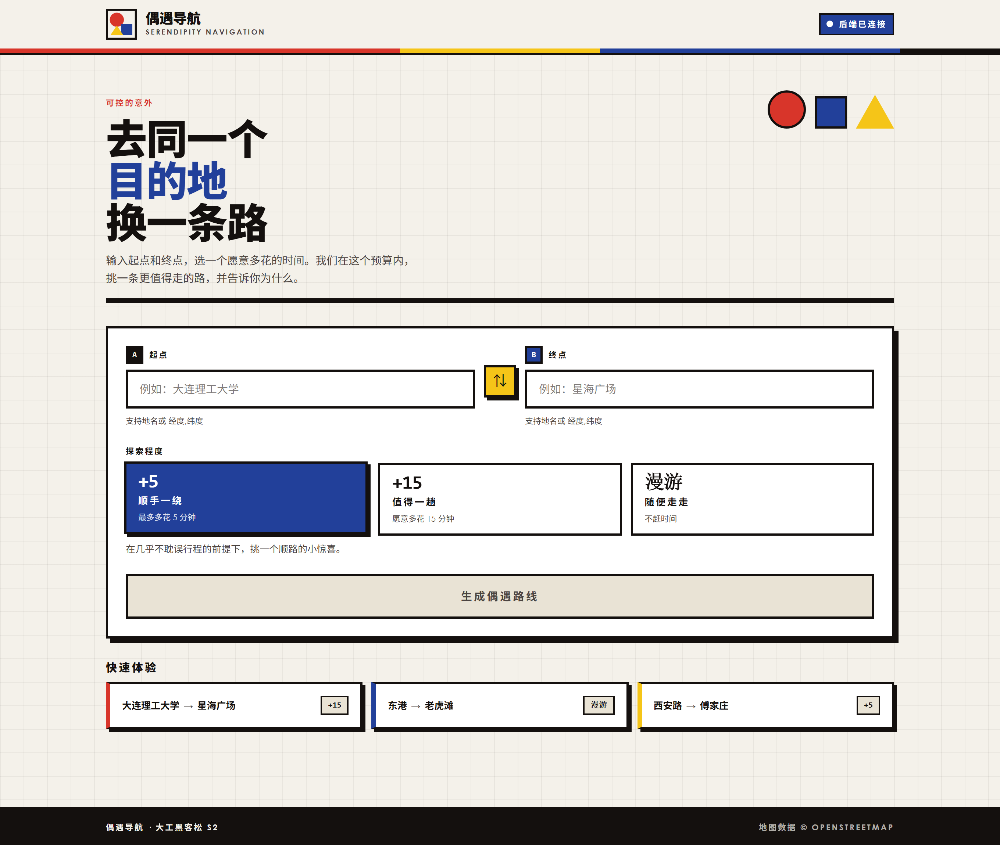
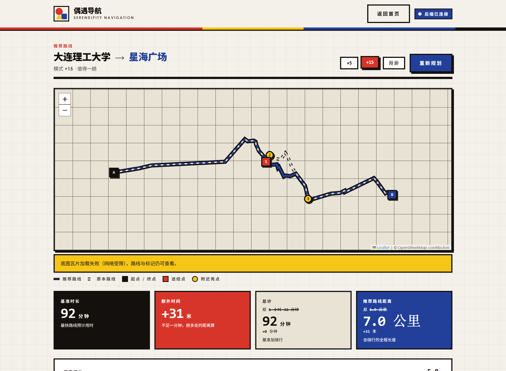

# 偶遇导航 · Serendipity Navigation

> 去同一个目的地，换一条路。

一个大连本地的步行路线推荐应用。你给出起点、终点，和一个「愿意多花多少时间」的预算，
它在这个预算内挑一条更值得走的路 —— 顺路捎上一两个值得停留的地方 —— 并把
「为什么是这条」摊开讲清楚。

和常规导航的区别在于目标函数：常规导航求最快，这里求「在你给的时间预算内，探索价值最高」。

## 界面

### 首页：填起终点，选探索程度



### 结果页：路线、指标、亮点、理由



## 功能

**三档探索程度**　`+5` 顺手一绕 / `+15` 值得一趟 / `漫游` 随便走走。三档的差别不只是
绕行上限，还包括「愿意为一个地方偏离主路多远」—— 同一条路线换个档位，选中的地方和
走的路都会变。结果页可以就地切换档位反复对比。

**同图对比**　推荐路线（蓝实线）和原本的最快路线（灰虚线）画在一张图上，换掉了什么一眼看得见。

**沿途亮点**　图上区分两种标记：**途经点**（红方块，路线真的穿过它）和**附近亮点**
（黄圆点，在路线旁边）。每个亮点标出到路线的真实距离，卡片可展开看地址、电话、营业时间、照片。

**探索评分**　7 分制，由亮点质量、口味契合度、绕行代价三项加减得出，结果页把这三项拆开显示。
凑不出自洽的拆分时只报总分，不摆一组加不出总数的数字。

**推荐理由**　用真实字段说话：沿途多了几处亮点、分别是什么、多花的时间在不在你选的额度内、
评分怎么来的。没有亮点可讲时如实说明，不硬凑理由。

**反馈闭环**　对路线点「还不错」或「一般」，系统按亮点类型记住偏好，影响后续推荐的打分。
界面会告诉你这次到底学到了什么类目 —— 没归因上也照实说。

**地点联想**　输入框支持地名联想与常用地标快选，也接受 `经度,纬度` 直接输入。

**离线可演示**　没有高德 Key 时自动降级到内置的大连演示数据，路线、亮点、文案齐全，
并在界面上明确标注「离线演示数据」，不会把估算值伪装成实时路网结果。

## 技术栈

| 层 | 选型 |
|---|---|
| 后端 | FastAPI + Python 3.11 |
| 前端 | Vue 3 + Vite |
| 地图 | Leaflet + OpenStreetMap 瓦片 |
| 数据 | 高德 Web 服务（步行路径 / POI / 地理编码 / 输入提示） |

坐标系约定：对外统一 WGS-84（前端、内置数据），对高德统一 GCJ-02，转换只在出入口各做一次。

## 启动

### 1. 后端

```bash
cd backend
python -m venv .venv
.venv\Scripts\activate          # Windows
# source .venv/bin/activate      # macOS / Linux
pip install -r requirements.txt
uvicorn app.main:app --reload
```

后端起在 `http://localhost:8000`。此时打开它就能用 —— 后端会同源托管
`webapp/dist` 里已构建好的前端，**不配高德 Key 也能跑**（走内置演示数据）。

### 2. 接入高德（可选，拿到真实路网与真实店铺）

在 `backend/` 下建 `.env`：

```
AMAP_KEY=你的高德 Web 服务 Key
```

重启后端即生效。Key 从[高德开放平台](https://lbs.amap.com/)申请，选「Web 服务」类型。

### 3. 前端开发模式（改前端代码时用）

```bash
cd webapp
npm install
npm run dev
```

前端起在 `http://localhost:5173`，接口自动代理到 8000 端口的后端，改代码热更新。
需要 Node 22.12 以上（仓库里有 `.nvmrc`）。

改完前端要让后端托管的版本也更新，重新构建一次：

```bash
npm run build
```

### 4. 快速上手

打开页面，点首页底部「快速体验」里任意一个卡片（大连理工大学 → 星海广场 / 东港 → 老虎滩 /
西安路 → 傅家庄），直接看结果。到了结果页可以点右上角三个档位反复对比。

## 测试

```bash
# 后端
cd backend
.venv\Scripts\python.exe -m pytest -q

# 前端单元测试
cd webapp
npm run test:run

# 浏览器冒烟 + 设计审计（需先起假后端）
node tests/mock-server.mjs 8000     # 另开一个终端
npm run smoke
npm run audit:design
```

## 目录

```
backend/          FastAPI 后端
  app/routes/     接口层
  app/services/   路径规划、POI、评分、叙事、坐标转换
  app/models/     用户偏好
  tests/          pytest
webapp/           Vue 3 前端
  src/views/      首页、结果页
  src/components/ 地图、指标块、亮点卡片、评分条等
  tests/          vitest + 浏览器冒烟 + 设计审计
docs/             计划、分工、进展记录
```

## 数据来源

地图数据 © [OpenStreetMap](https://www.openstreetmap.org/copyright) contributors，
路径与 POI 数据来自[高德开放平台](https://lbs.amap.com/)。
